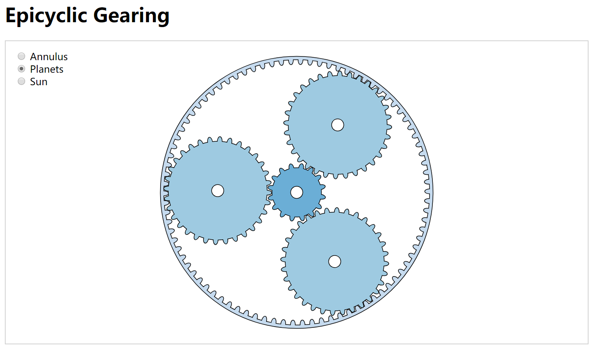

# epicyclic-gearing
coding practice

## inspiration

https://bl.ocks.org/mbostock/1353700

## result

## future work

coordinate the gears

now it appeares coordinated just by chance. change the number of planets or other parameters like toothHeight, and you'll see them overlapping. 